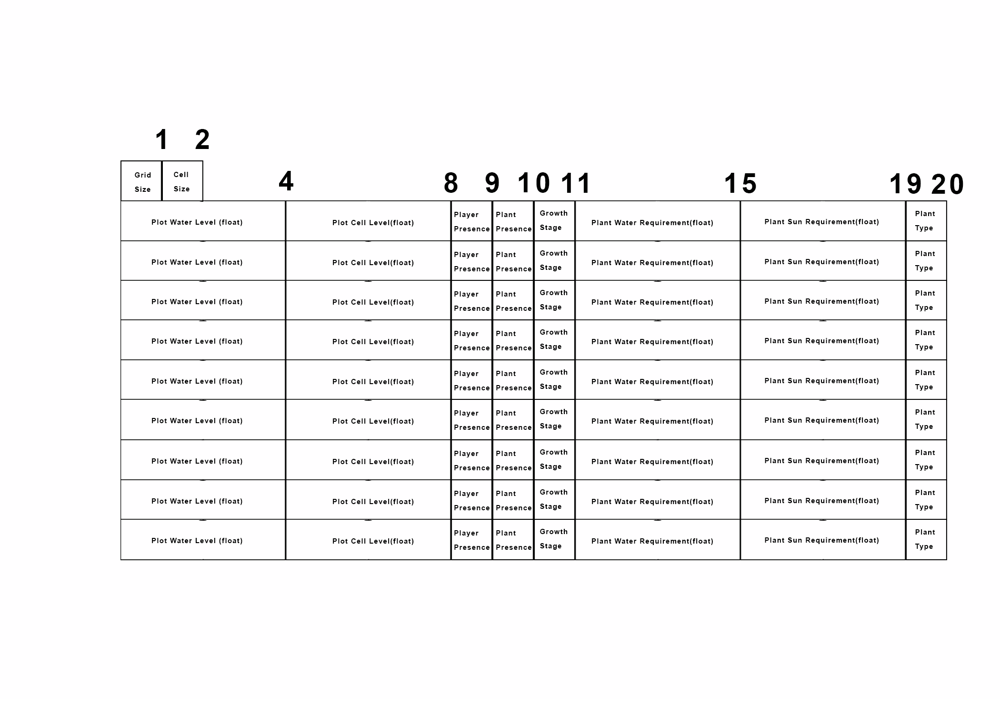

# Devlog Entry 1 - 11/15/2024

## Introducing the Team
**Tools Lead:**  
Zane Shan  
**Engine Lead:**  
James Yim  
**Design Lead:**  
Leif Tanner  

---

## Tools and Materials

### Engines, Libraries, Frameworks, and Platforms
We plan to use **Godot**. Godot has a lot of built-in functionality, and we do not perceive the need for outside libraries or frameworks.

### Programming and Data Languages
We plan to use **C#** and **GDScript**. GDScript is built for Godot and has extensive functionality for game development.

### Tools for Authoring the Project
- **IDE:** VSCode, because it is what we are accustomed to.  
- **Image Editor:** Aseprite, as we plan to create pixel art and already own Aseprite.  

### Alternate Platform Choice
Our alternate platform will be **Unity**, as it differs significantly from Godot. It relies more heavily on **C#** or **C++**, rather than GDScript.

---

## Outlook

### Unique Goals
Our team aims to challenge ourselves by programming in **GDScript**, an unfamiliar language, despite being more comfortable with **C#**. This sets us apart as most teams might stick to what they know best.

### Anticipated Challenges
The most difficult part of the project will be the **learning curve**:
- Adapting to a new engine, **Godot**.
- Learning and applying **GDScript**, Godot’s scripting language.

### Learning Objectives
We aim to:
- Master scripting with **GDScript**.
- Familiarize ourselves with Godot’s unique **scene system** and **user interface navigation**.  
If time permits, we plan to:
- Create custom sprites and assets in **Aseprite** and import them into the game.

--- 

# Devlog Entry 2 - 11/27/2024

## How we satisfied the software requirements
### [F0.a] You control a character moving over a 2D grid.
We implemented a controllable character that moves using arrow keys. We created a placeholder farmer sprite in Aseprite to represent the player object.

### [F0.b] You advance time manually in the turn-based simulation.
We implemented a pressable button that advances time forward by a day. It changes water and sun values on the grid cells (we call them plots in the code) for every new day, then calls a grow method on existing plants which checks if criteria (water, sun, spatial rules) are met for the next growth stage.

### [F0.c] You can reap or sow plants on grid cells only when you are near them.
The player model can only plant and harvest crops they are directly above.

### [F0.d] Grid cells have sun and water levels. Each cell's incoming sun and water is somehow randomly generated each turn. Sun energy cannot be stored in a cell (it is used immediately or lost) while water moisture can be slowly accumulated over several turns.
Every grid cell has a respective water and sun integer which plants reference when they are growing. The sun values are random, while water levels accumulate, adding a random value to its total. Here is how these values are calculated each day:
plot.sun_level = randf_range(sun_level_range.x, sun_level_range.y)
plot.water_level += randf_range(water_change_range.x, water_change_range.y)

### [F0.e] Each plant on the grid has a distinct type (e.g. one of 3 species) and a growth level (e.g. “level 1”, “level 2”, “level 3”).
We have three plants all inheriting a base “plant” class, each with distinctive rules governing their growth and unique placeholder sprites. They can grow up to stage 3, after which the player can harvest them.

### [F0.f] Simple spatial rules govern plant growth based on sun, water, and nearby plants (satisfying conditions unlock growth).
Beyond water and sun requirements for every plant, there are unique rules plants must follow to grow: lettuce can only grow near other lettuce, tomato can only grow when alone, having any plants adjacent prohibits growth, and carrots can only grow near other types other than themselves, or by themselves.

### [F0.g] A play scenario is completed when some condition is satisfied (e.g. at least X plants at growth level Y or above).
We are currently working on a scenario where players must achieve a certain number of plants at growth level 3 to complete a scenario.

## Reflection
We haven’t changed the tools for the project, but our use of role titles has been very lenient. Since two in our group do not have experience in Godot and are eager to learn the engine and Godot’s native scripting language, (and since Godot packages most of its libraries together) we haven't been coordinating in terms of art direction and tools. In actuality, the only role that has been consistent is the production/design lead, which is Leif. We have not been using VSCode for our IDE as well; Godot has a native IDE built into its UI, which we are using.

--- 

# Devlog Entry 3 - 12/2/2024

## How we satisfied the software requirements

### [F0.a] You control a character moving over a 2D grid.
Same as last week.

### [F0.b] You advance time manually in the turn-based simulation.
Same as last week.

### [F0.c] You can reap or sow plants on grid cells only when you are near them.
Same as last week.

### [F0.d] Grid cells have sun and water levels. Each cell's incoming sun and water is somehow randomly generated each turn. Sun energy cannot be stored in a cell (it is used immediately or lost) while water moisture can be slowly accumulated over several turns.
Same as last week.

### [F0.e] Each plant on the grid has a distinct type (e.g. one of 3 species) and a growth level (e.g. “level 1”, “level 2”, “level 3”).
Same as last week.

### [F0.f] Simple spatial rules govern plant growth based on sun, water, and nearby plants (satisfying conditions unlock growth).
Same as last week.

### [F0.g] A play scenario is completed when some condition is satisfied (e.g. at least X plants at growth level Y or above).
Same as last week.

### [F1.a] The important state of your game's grid must be backed by a single contiguous byte array in AoS or SoA format. If your game stores the grid state in multiple format, the byte array format must be the primary format (i.e. other formats are decoded from it as needed).
For the contiguous byte array we used an array of structures. We do this because we have multiple plots so each plot is its own structure where information such as sun level and water level but also info such as if there is a plant or player on the plot. In Godot we used the function PackedByteArray. It made it easy in that it gave the structure we wanted already so it made it very easy for us to implement our contiguoys byte array.

### [F1.b] The player must be able to manually save their progress in the game. This must allow them to load state and continue play another day (i.e. after quitting the game app). The player must be able to manage multiple save files/slots.
The player is able to save their progres manually by way of three different save slots. Each of these saves to their own specific file and is able to be loaded individually as needed by the player. We use the function FileAccess.open() to open files and save the data to the file.

### [F1.c] The game must implement an implicit auto-save system to support recovery from unexpected quits. (For example, when the game is launched, if an auto-save entry is present, the game might ask the player "do you want to continue where you left off?" The auto-save entry might or might not be visible among the list of manual save entries available for the player to load as part of F1.b.)
We refactored our save function for the manual save and translated so that it works seemlessly for auto saving. We autosave every time there is a new turn in order to save big changes. We have a prompt that asks the player to decide if they want to load from the latest auto save. If they do not they can load from one of their manual saves. 

### [F1.d] The player must be able to undo every major choice (all the way back to the start of play), even from a saved game. They should be able to redo (undo of undo operations) multiple times.
Because we save after every turn, we automatically are able to undo every major choice based on the latest change. We are also able to redo an undo using a seperate redo stack in order to keep track of the changes. 

### Byte Array Diagram

## Reflection
The only mindset change we had coming into this sprint was how we structured our code to better help us in the future. We made sure that functions were really one purpose functions so that debugging was made easier. We did this so that future requirements could be implemented seemlessly and in doing so this made it easier to explain our code.

--- 

# Devlog Entry 4 - 12/6/2024

## How we satisfied the software requirements

### [F0.a] You control a character moving over a 2D grid.
Same as last week.

### [F0.b] You advance time manually in the turn-based simulation.
Same as last week.

### [F0.c] You can reap or sow plants on grid cells only when you are near them.
Same as last week.

### [F0.d] Grid cells have sun and water levels. Each cell's incoming sun and water is somehow randomly generated each turn. Sun energy cannot be stored in a cell (it is used immediately or lost) while water moisture can be slowly accumulated over several turns.
Same as last week.

### [F0.e] Each plant on the grid has a distinct type (e.g. one of 3 species) and a growth level (e.g. “level 1”, “level 2”, “level 3”).
Same as last week.

### [F0.f] Simple spatial rules govern plant growth based on sun, water, and nearby plants (satisfying conditions unlock growth).
Same as last week.

### [F0.g] A play scenario is completed when some condition is satisfied (e.g. at least X plants at growth level Y or above).
Same as last week.

### [F1.a] The important state of your game's grid must be backed by a single contiguous byte array in AoS or SoA format. If your game stores the grid state in multiple format, the byte array format must be the primary format (i.e. other formats are decoded from it as needed).
Same as last week.

### [F1.b] The player must be able to manually save their progress in the game. This must allow them to load state and continue play another day (i.e. after quitting the game app). The player must be able to manage multiple save files/slots.
Same as last week.

### [F1.c] The game must implement an implicit auto-save system to support recovery from unexpected quits. (For example, when the game is launched, if an auto-save entry is present, the game might ask the player "do you want to continue where you left off?" The auto-save entry might or might not be visible among the list of manual save entries available for the player to load as part of F1.b.)
Same as last week.

### [F1.d] The player must be able to undo every major choice (all the way back to the start of play), even from a saved game. They should be able to redo (undo of undo operations) multiple times.
Same as last week.

### [F2.a] External DSL for scenario designs: In separate text file or text block, designers should be able to express the design of different gameplay scenarios, e.g. starting conditions, weather randomization policy, and victory conditions. The language must be able to schedule unique events that happen at specific times. (Think about how you could define a level progression by putting the details specific to each level in a separate text file or one big file describing the progression as a sequence.)
### External DSL for Scenario Design
We used an external DSL in order to organize plot conditions in our game. The following is how we use our DSL:
We chose to use JSON as our file type of choice. The following is an example json file with plot conditions: 
```
{
	"grid_size": 3,
	"sun_range": {
		"min": 1,
		"max": 10
	},
	"water_range": {
		"min": 1,
		"max": 10
	}
}
```
We can then parse this data using the following function in GodotScript:
```
var scenario_data = ScenarioParser.parse_scenario("res://config.json")
```
We can then set values according to the external DSL:
```
grid_size = scenario_data.get("grid_size")
sun_range = scenario_data.get("sun_range")
water_range = scenario_data.get("water_range")
```

### [F2.b] Internal DSL for plant types and growth conditions: Within the main programming language used for the rest of your game, you should implement and use a domain-specific language for defining your different types of plants and the unique growth rules that apply to each
### Internal DSL for Plants and Growth Conditions
We used an internal DSL in order to organize the plant growth behaviors within our game. The following is how to use our DSL in GodotScript: 
In our Plant Class we initalize an enum for different plant types, you can add any number of plant types to this enum: 
```
enum PlantType { LETTUCE, TOMATO, CARROT }
```
We then define a base class for growth rules so individual plant rules can inherit:
```
# Base class for growth rules
class GrowthRule:
	func can_grow(plant, plot) -> bool:
		return false

```
We then can define a specific rule for a specific plant type:
```
# Specific growth rules for each plant type
class LettuceGrowthRule extends GrowthRule:
	func can_grow(plant, plot) -> bool:
		return plot.get_adjacent_plots().any(
			func(adjacent) -> bool:
				return adjacent.has_plant() and adjacent.get_plant().type == PlantType.LETTUCE
		)
```
We then have to assign the growth rule to our plant based on its specific type:
```
PlantType.LETTUCE: LettuceGrowthRule.new(),
PlantType.TOMATO: TomatoGrowthRule.new(),
PlantType.CARROT: CarrotGrowthRule.new()
```
Then we can simply call a generic function as such to trigger the specific behavior:
```
plant.grow(plot)
```
### [F2.c] Switch to an alternate platform: Change either your project's primary programming language or your primary user interface library/engine/framework. As more of your design is expressed in DSLs, your design becomes increasingly insulated from changes to your primarily programming language or engine. Using your earlier implementation as a reference, it becomes more realistic that you'd be able to leverage generative AI for the large but mostly mindless translations from one language or engine to another.
Our intial idea was to move from godotScript to C#. We attempted this and got some of our features to work but a lot of our other ones most specifically the continuous byte array was causing us the most hardship. We decided to scrap the idea of changing languages and instead just focus on the rest of the requirements.

## Reflection
We realized that it would be hard to switch languages in the time frame we had. We focused more on the structure of our game rather than changing it to a better platform. This made us think that maybe our previous code architecture was not well suited for such a big change. This made us appreciate the idea of DSL's and that if we had better thought
about our architecture switching languages would have been a lot easier.
--- 

# Devlog Entry 5 - 12/6/2024

## How we satisfied the software requirements

### [F0.a] You control a character moving over a 2D grid.
Same as last week.

### [F0.b] You advance time manually in the turn-based simulation.
Same as last week.

### [F0.c] You can reap or sow plants on grid cells only when you are near them.
Same as last week.

### [F0.d] Grid cells have sun and water levels. Each cell's incoming sun and water is somehow randomly generated each turn. Sun energy cannot be stored in a cell (it is used immediately or lost) while water moisture can be slowly accumulated over several turns.
Same as last week.

### [F0.e] Each plant on the grid has a distinct type (e.g. one of 3 species) and a growth level (e.g. “level 1”, “level 2”, “level 3”).
Same as last week.

### [F0.f] Simple spatial rules govern plant growth based on sun, water, and nearby plants (satisfying conditions unlock growth).
Same as last week.

### [F0.g] A play scenario is completed when some condition is satisfied (e.g. at least X plants at growth level Y or above).
Same as last week.

### [F1.a] The important state of your game's grid must be backed by a single contiguous byte array in AoS or SoA format. If your game stores the grid state in multiple format, the byte array format must be the primary format (i.e. other formats are decoded from it as needed).
Same as last week.

### [F1.b] The player must be able to manually save their progress in the game. This must allow them to load state and continue play another day (i.e. after quitting the game app). The player must be able to manage multiple save files/slots.
Same as last week.

### [F1.c] The game must implement an implicit auto-save system to support recovery from unexpected quits. (For example, when the game is launched, if an auto-save entry is present, the game might ask the player "do you want to continue where you left off?" The auto-save entry might or might not be visible among the list of manual save entries available for the player to load as part of F1.b.)
Same as last week.

### [F1.d] The player must be able to undo every major choice (all the way back to the start of play), even from a saved game. They should be able to redo (undo of undo operations) multiple times.
Same as last week.

### [F2.a] External DSL for scenario designs: In separate text file or text block, designers should be able to express the design of different gameplay scenarios, e.g. starting conditions, weather randomization policy, and victory conditions. The language must be able to schedule unique events that happen at specific times. (Think about how you could define a level progression by putting the details specific to each level in a separate text file or one big file describing the progression as a sequence.)
Same as last week.

### [F2.b] Internal DSL for plant types and growth conditions: Within the main programming language used for the rest of your game, you should implement and use a domain-specific language for defining your different types of plants and the unique growth rules that apply to each
Same as last week.

### [F2.c] Switch to an alternate platform: Change either your project's primary programming language or your primary user interface library/engine/framework. As more of your design is expressed in DSLs, your design becomes increasingly insulated from changes to your primarily programming language or engine. Using your earlier implementation as a reference, it becomes more realistic that you'd be able to leverage generative AI for the large but mostly mindless translations from one language or engine to another.
Same as last week.

### [F3.a] The game must be internationalized in way that allows all text visible to the player to be translated into different written languages (i.e. there are no messages that are hard-coded to display only English-language text, but it is fine for this requirement if English is the only supported display language).
All text within the game can be translated, the method of which we did this is through Godot's built in import translation feature. We trabnslated all text from the game onto google sheets, each word represented by a key followed by its translation into 3 different languages. The .csv file it is imported into is formatted like so:
```
	key,es,it,fr,en
	Turn Complete,Turno Completo,Turno Completo,Turno Completo,Turn Complete
```
After importing this into godot and setting it as the localization file in project settings, we can reference the key anywhere to get its trabslation. 
```
	var italian_button = $ItalianButton
	italian_button.text = tr("Italian")
```
### [F3.b] The game must be localized to support three different written languages. At least one language must use a logographicLinks to an external site. script, and at least one language must use a right-to-leftLinks to an external site. script.
	The three languages we chose to localize in were French, Spanish, and Italian. 

### [F3.c] The game must be installable on a smartphone-class mobile device in the sense that there is a way to get it to show up as a home-screen icon that feels similar to other installed apps. (It is okay if you only get this to work on one specific device. You do not need to deploy the game in a way that anyone else can install it without your help because that might be much more difficult for some game platforms.)
	The game is installable on android through a .APK file. It shows up as an app once installed onto the phone.

### [F3.d] Once installed in a mobile device, the game can be launched and satisfactorily played even when the device is not connected to the internet.
	The game is playable offline, no internet service is required to launch the app and immediately begin playing.

### Internationalization
# The devlog should explain how your code has changed to distinguish between strings internal to the program and strings that will be shown to the player (needing localization). If you did something clever with your language's type system so that the compiler helps you catch incomplete translations or other missing messages, brag about that in this section. This section should outline which code or data files need to get changed when adding support for a new language or adding a new translatable message to the game.
No changes to the code were required for Localization. We had already implemented our code in a way so that the strings in the buttons and labels could be referenced and changed from another area in the code.

### Localization
# Tell us about which three languages your game supports. For each language, tell us about how you accomplished that localization. Did a team member use their own knowledge of the language? Did you have a friend, volunteer classmate, or paid expert help? Did you make use of a tool like ChatGPT to help? (If so, describe your prompts so that we can see how you gave the system extra context for your project. How should the user select which language will be used? Do they change the language setting from inside the game? Did you release three different versions of the game with a different language hard-coded into each? Does the player launch the game with special options (e.g. command line arguments or URL parameters) that encode the choice of language? 
The three languages we supported are French, Spanish, and Italian. For each, we used ChatGPT in order to translate the words. The prompts we gave were simple, translate this word/phrase in the context of a farming game. There are four buttons on the top right to switch the language, one button for each localization and english to revert it back to normal. 

### Mobile Installation
# How did you get your game to be installable on a smartphone-class mobile device? If you followed a tutorial, guide, video, or blogpost, directly link to those resources that helped you learn. What changes were needed to make the game installable?
Several guides were followed to ensure that the game was playable.
https://www.youtube.com/watch?v=XqmzmYMhT7g
We ran into an error where we ccouldnt locate an SDk to facilitate a mobile export, that was solved following this documentation:
https://docs.godotengine.org/en/stable/tutorials/export/exporting_for_android.html

### Mobile Play (Offline)
# What changes to your design were needed to make it play well on a mobile device? Were there any changes needed to make sure it worked in the offline case?
No changes were required to ensure that the game ran without internet.

## Reflection
# Looking back on how you achieved the new F3 requirements, how has your team’s plan changed? Did you reconsider any of the choices you previously described for Tools and Materials or your Roles? Has your game design evolved now that you've started to think about giving the player more feedback? It would be very suspicious if you didn’t need to change anything. There’s learning value in you documenting how your team’s thinking has changed over time.
Out of all the other requirements, the ones in f3 were by far the easiest. Our implementationin previous areas ensured that changing into mobile would be a painless process, and localizing the game was just a matter of referencing strings and a .csv translation file. 
